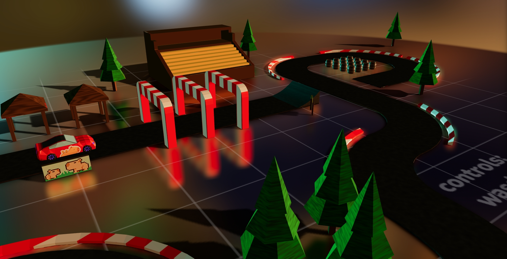
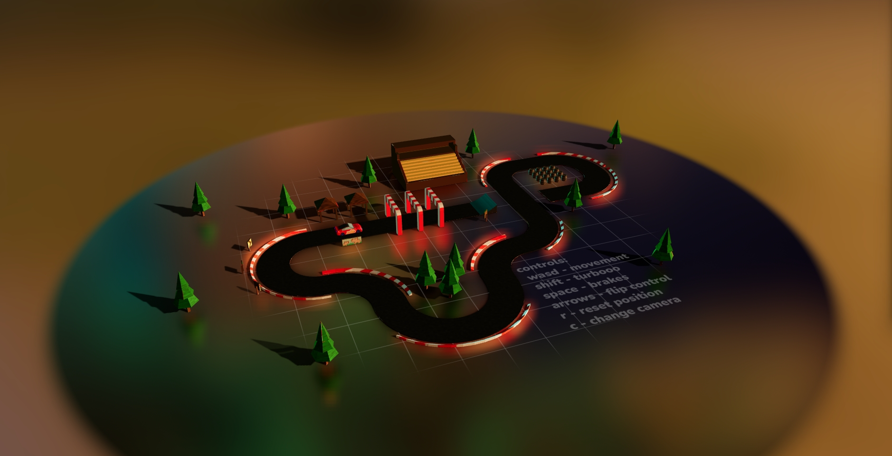
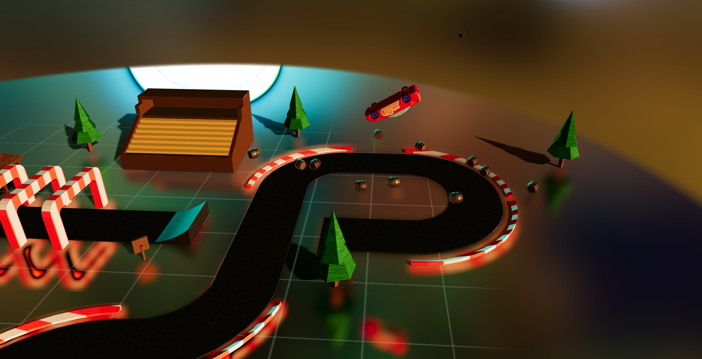
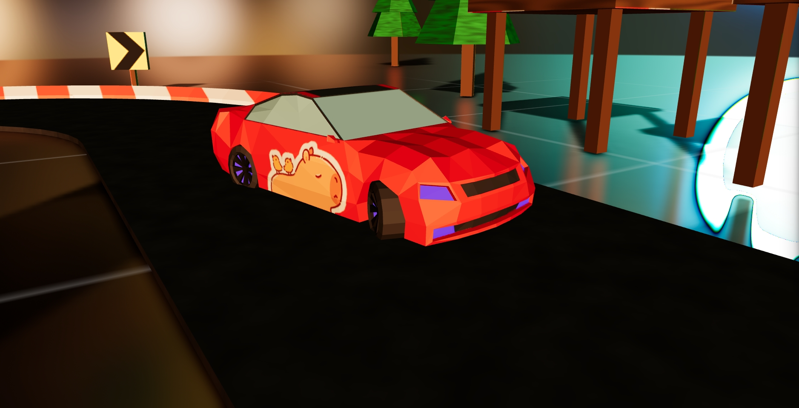
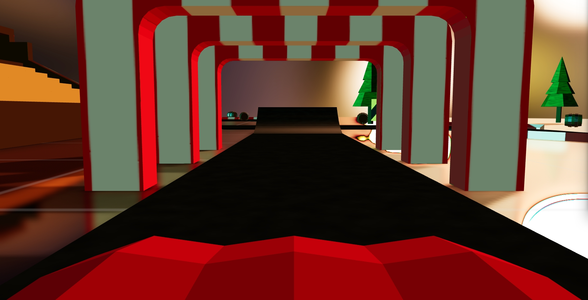

# R3F Car Racing

**A 3D mini game i amdded its has top view camera angel thats so crazy looking 

By driving a car around a small race track, manipulating objects and performing flips you willmake it much better
.in this project the hardest and time taking part is to dedgien my car its too hard and i spent almost 8 hours to dedgine the car properly 
the game is super cool working but have a problem its load soo late first time 




## Project Structure and Technologies Used

The project uses the following key libraries and tools:

- **React-three-fiber (R3F)** - is a library for React designed to create 3D scenes using the three.js library. (Integration between Three.js and React)
- **Cannon.js** - is a physics engine for JavaScript designed to simulate the physics of objects. (For example, collisions and dynamic movements).
- **Blender** - is a powerful and free 3D modeling tool. It provides a wide range of tools for creating 3D objects and scenes

```structure
R3F-CAR-RACING
├── public
│   ├── models/         // .glb objects
│   ├── textures/       // textures (not used directly)
│   └── screenshots/    // previews
├── src
│   ├── assets
│   │   └── global.css
│   │
│   ├── components      // r3f objects
│   │   ├── Scene.jsx   // main scene
│   │   ├── Track.jsx   // scene collisions
│   │   ├── Car.jsx     // car body (wheels, chassis, apply controls)
│   │   └── ...         // other scene elements
│   │
│   ├── hooks
│   │   ├── useWheels.jsx       // 4 wheel chassis
│   │   └── useControls.jsx     // using chassisApi and vehicleApi
│   │
│   └── main.jsx        // entrypoint
│
├── .gitignore
├── index.html
└── README.md  // <- u are here :^
```

## Get Started

Try the game is on your browser clcik it to view https://aryabuilds.github.io/Car-Game-/

 

## Screentshots

<div align="center">
    
    
    
    
    
</div>

